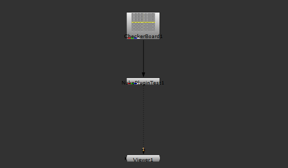

# Nuke Plugin Test

## Introduction
A basic plugin structure for nuke.

## Table of Contents
- [Installation](#installation)
- [Usage](#usage)
- [Features](#features)
- [Dependencies](#dependencies)
- [Configuration](#configuration)
- [Documentation](#documentation)
- [Examples](#examples)
- [Troubleshooting](#troubleshooting)
- [Contributors](#contributors)
- [License](#license)

## Installation
Instructions on how to install the project.

## Usage
How to use the project after installation.

## Features
List of features and what makes the project stand out.

## Dependencies
Details of any software or libraries required.

## Configuration
Information on configuring the software after installation, if necessary.

## Documentation
Link to full project documentation or embed key information here.

## Examples
Examples of how to use the project, including code snippets or links to demos.

## Troubleshooting
Common issues and their solutions or troubleshooting steps.

## Contributors
List of people who have contributed to the project.

## License
MIT License.

